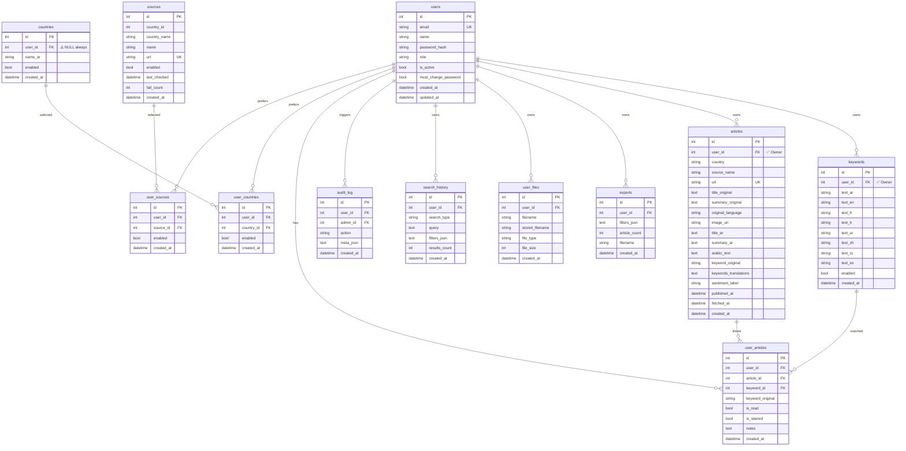

# 📊 تقرير اكتشاف قاعدة البيانات - Ain News Monitor
**تاريخ التقرير:** 2026-01-12

---

## 1. نوع قاعدة البيانات والاتصال

### 🔧 DB Engine
| البند | القيمة | الدليل |
|-------|--------|--------|
| **Engine** | SQLite 3 | `models.py:160` |
| **Database File** | `ain_news.db` | `backend/ain_news.db` (3.67 MB) |
| **Connection String** | `sqlite:///ain_news.db` | `models.py:160` |
| **ORM** | SQLAlchemy | `models.py:2-4` |

### 📁 ملفات الإعداد
```
backend/
├── models.py          # تعريف الجداول + إعداد الاتصال
├── config.py          # إعدادات التطبيق (لا يحتوي DATABASE_URL)
├── .env               # متغيرات البيئة (API keys)
└── .env.example       # نموذج الإعدادات
```

### 🔑 Evidence - إثبات SQLite
```python
# models.py:160-162
DATABASE_URL = "sqlite:///ain_news.db"
engine = create_engine(DATABASE_URL, connect_args={"check_same_thread": False})
SessionLocal = sessionmaker(autocommit=False, autoflush=False, bind=engine)
```

### ⚠️ ملاحظة هامة
**لا يوجد Alembic migrations!** - المشروع يستخدم سكربتات هجرة يدوية:
- `migrate_db.py`
- `migrate_db_complete.py`
- `migrate_db_v2.py`
- `migrate_keywords_per_user.py`
- `fix_schema.py`

---

## 2. جرد Schema الكامل

### 📋 قائمة الجداول (13 جدول)

| الجدول | الوظيفة | عدد الصفوف | Scope |
|--------|---------|------------|-------|
| `users` | المستخدمين | 6 | System |
| `countries` | قائمة الدول | 50 | Shared Catalog |
| `sources` | مصادر RSS | 201 | Shared Catalog |
| `keywords` | الكلمات المفتاحية | 3 | **Per-User** |
| `articles` | المقالات المحفوظة | 71 | **Per-User** |
| `exports` | سجلات التصدير | 1 | **Per-User** |
| `user_files` | ملفات المستخدم | 0 | **Per-User** |
| `search_history` | سجل البحث | 0 | **Per-User** |
| `audit_log` | سجل التدقيق | 131 | System |
| `user_articles` | علاقة N-M مستخدم-مقالات | 423 | **Per-User** |
| `user_countries` | تفضيلات دول المستخدم | 300 | **Per-User** |
| `user_sources` | تفضيلات مصادر المستخدم | 1,212 | **Per-User** |
| `articles_new` | جدول مؤقت (migration artifact) | 0 | Orphan |

---

### 📊 تفاصيل كل جدول

#### 1. `users` - المستخدمين
```sql
CREATE TABLE users (
    id INTEGER PRIMARY KEY NOT NULL,
    email VARCHAR(255) NOT NULL UNIQUE,
    name VARCHAR(255),
    password_hash VARCHAR(255) NOT NULL,
    role VARCHAR(20) NOT NULL,           -- 'ADMIN' | 'USER'
    is_active BOOLEAN,
    must_change_password BOOLEAN,
    created_at DATETIME,
    updated_at DATETIME
);
-- INDEX: sqlite_autoindex_users_1 (email) UNIQUE
```

#### 2. `countries` - الدول (Shared Catalog)
```sql
CREATE TABLE countries (
    id INTEGER PRIMARY KEY NOT NULL,
    user_id INTEGER,                     -- ⚠️ موجود لكن غير مستخدم (NULL دائماً)
    name_ar VARCHAR(100) NOT NULL,
    enabled BOOLEAN,
    created_at DATETIME,
    FOREIGN KEY (user_id) REFERENCES users(id)
);
-- INDEX: ix_countries_user_id (user_id)
```

#### 3. `sources` - مصادر RSS (Shared Catalog)
```sql
CREATE TABLE sources (
    id INTEGER PRIMARY KEY NOT NULL,
    country_id INTEGER NOT NULL,
    country_name VARCHAR(100) NOT NULL,
    name VARCHAR(200) NOT NULL,
    url VARCHAR(500) NOT NULL UNIQUE,
    enabled BOOLEAN,
    last_checked DATETIME,
    fail_count INTEGER,
    created_at DATETIME
);
-- INDEX: sqlite_autoindex_sources_1 (url) UNIQUE
```

#### 4. `keywords` - الكلمات المفتاحية (Per-User)
```sql
CREATE TABLE keywords (
    id INTEGER PRIMARY KEY,
    user_id INTEGER,                     -- ✅ مالك الكلمة
    text_ar VARCHAR(200) NOT NULL,
    text_en VARCHAR(200),
    text_fr VARCHAR(200),
    text_tr VARCHAR(200),
    text_ur VARCHAR(200),
    text_zh VARCHAR(200),
    text_ru VARCHAR(200),
    text_es VARCHAR(200),
    enabled BOOLEAN DEFAULT 1,
    created_at DATETIME,
    UNIQUE(user_id, text_ar)
);
-- INDEX: sqlite_autoindex_keywords_1 (user_id, text_ar) UNIQUE
```

#### 5. `articles` - المقالات (Per-User)
```sql
CREATE TABLE articles (
    id INTEGER PRIMARY KEY NOT NULL,
    user_id INTEGER,                     -- ✅ مالك المقال
    country VARCHAR(100) NOT NULL,
    source_name VARCHAR(200) NOT NULL,
    url VARCHAR(500) NOT NULL UNIQUE,
    title_original TEXT NOT NULL,
    summary_original TEXT,
    original_language VARCHAR(10),
    image_url VARCHAR(1000),
    title_ar TEXT,
    summary_ar TEXT,
    arabic_text TEXT,
    keyword VARCHAR(200),                -- OLD (deprecated)
    keyword_original VARCHAR(200),       -- NEW
    keywords_translations TEXT,          -- JSON
    sentiment VARCHAR(50),               -- OLD (deprecated)
    sentiment_label VARCHAR(50),         -- NEW: إيجابي/سلبي/محايد
    sentiment_score VARCHAR(20),
    language VARCHAR(10),                -- OLD (deprecated)
    published_at DATETIME,
    fetched_at DATETIME,
    created_at DATETIME,
    FOREIGN KEY (user_id) REFERENCES users(id)
);
-- INDEX: ix_articles_user_id (user_id)
-- INDEX: sqlite_autoindex_articles_1 (url) UNIQUE
```

#### 6. `exports` - سجلات التصدير (Per-User)
```sql
CREATE TABLE exports (
    id INTEGER PRIMARY KEY NOT NULL,
    user_id INTEGER NOT NULL,            -- ✅ مالك التصدير
    filters_json TEXT,
    article_count INTEGER,
    filename TEXT,
    stored_filename TEXT,
    file_size INTEGER,
    source_type TEXT,
    created_at DATETIME,
    FOREIGN KEY (user_id) REFERENCES users(id)
);
-- INDEX: ix_exports_user_id (user_id)
```

#### 7. `user_files` - ملفات المستخدم (Per-User)
```sql
CREATE TABLE user_files (
    id INTEGER PRIMARY KEY NOT NULL,
    user_id INTEGER NOT NULL,
    filename VARCHAR(255) NOT NULL,
    stored_filename VARCHAR(255) NOT NULL,
    file_type VARCHAR(50),
    file_size INTEGER,
    description TEXT,
    created_at DATETIME,
    FOREIGN KEY (user_id) REFERENCES users(id)
);
-- INDEX: ix_user_files_user_id (user_id)
```

#### 8. `search_history` - سجل البحث (Per-User)
```sql
CREATE TABLE search_history (
    id INTEGER PRIMARY KEY NOT NULL,
    user_id INTEGER NOT NULL,
    search_type VARCHAR(50) NOT NULL,    -- 'keyword', 'direct', 'headlines'
    query TEXT,
    filters_json TEXT,
    results_count INTEGER,
    created_at DATETIME,
    FOREIGN KEY (user_id) REFERENCES users(id)
);
-- INDEX: ix_search_history_user_id (user_id)
```

#### 9. `audit_log` - سجل التدقيق (System)
```sql
CREATE TABLE audit_log (
    id INTEGER PRIMARY KEY NOT NULL,
    user_id INTEGER,
    admin_id INTEGER,
    action VARCHAR(100) NOT NULL,
    meta_json TEXT,
    created_at DATETIME,
    FOREIGN KEY (user_id) REFERENCES users(id),
    FOREIGN KEY (admin_id) REFERENCES users(id)
);
-- INDEX: ix_audit_log_user_id (user_id)
-- INDEX: ix_audit_log_admin_id (admin_id)
```

#### 10-12. Junction Tables (Per-User) - ⚠️ غير موجودة في models.py!

```sql
-- user_articles: علاقة N-M بين المستخدمين والمقالات
CREATE TABLE user_articles (
    id INTEGER PRIMARY KEY NOT NULL,
    user_id INTEGER NOT NULL,
    article_id INTEGER NOT NULL,
    keyword_id INTEGER,
    keyword_original VARCHAR(200),
    keywords_translations TEXT,
    sentiment_label VARCHAR(50),
    sentiment_score VARCHAR(20),
    is_read BOOLEAN,
    is_starred BOOLEAN,
    notes TEXT,
    created_at DATETIME,
    UNIQUE(user_id, article_id),
    FOREIGN KEY (user_id) REFERENCES users(id),
    FOREIGN KEY (article_id) REFERENCES articles(id),
    FOREIGN KEY (keyword_id) REFERENCES keywords(id)
);

-- user_countries: تفضيلات الدول لكل مستخدم
CREATE TABLE user_countries (
    id INTEGER PRIMARY KEY NOT NULL,
    user_id INTEGER NOT NULL,
    country_id INTEGER NOT NULL,
    enabled BOOLEAN,
    created_at DATETIME,
    UNIQUE(user_id, country_id),
    FOREIGN KEY (user_id) REFERENCES users(id),
    FOREIGN KEY (country_id) REFERENCES countries(id)
);

-- user_sources: تفضيلات المصادر لكل مستخدم
CREATE TABLE user_sources (
    id INTEGER PRIMARY KEY NOT NULL,
    user_id INTEGER NOT NULL,
    source_id INTEGER NOT NULL,
    enabled BOOLEAN,
    created_at DATETIME,
    UNIQUE(user_id, source_id),
    FOREIGN KEY (user_id) REFERENCES users(id),
    FOREIGN KEY (source_id) REFERENCES sources(id)
);
```

---

## 3. ERD - مخطط العلاقات (Mermaid)



---

## 4. جرد البيانات والتوزيعات

### 📈 إحصائيات عامة

| الجدول | العدد |
|--------|-------|
| users | 6 |
| countries | 50 |
| sources | 201 |
| keywords | 3 |
| articles | 71 |
| user_articles | 423 |
| user_countries | 300 |
| user_sources | 1,212 |
| exports | 1 |
| audit_log | 131 |
| search_history | 0 |
| user_files | 0 |

### 👥 توزيع المستخدمين

| ID | Email (Redacted) | Role | Active |
|----|------------------|------|--------|
| 1 | eli***@*** | ADMIN | ✅ |
| 2 | mrs***@*** | USER | ✅ |
| 3 | vvv***@*** | USER | ✅ |
| 4 | ddd***@*** | USER | ✅ |
| 5 | sss***@*** | USER | ✅ |
| 6 | aaa***@*** | USER | ✅ |

### 🔑 توزيع Keywords لكل مستخدم

| user_id | عدد الكلمات |
|---------|-------------|
| 3 | 2 |
| 1 (Admin) | 1 |
| **NULL** | **0** ✅ |

### 📰 توزيع Articles لكل مستخدم

| user_id | عدد المقالات |
|---------|--------------|
| 1 (Admin) | 54 |
| 3 | 17 |
| **NULL** | **0** ✅ |

### ⚠️ الشذوذ والمشاكل المكتشفة

| المشكلة | العدد | الخطورة |
|---------|-------|---------|
| Orphaned articles (user_id غير موجود) | 0 | ✅ |
| Orphaned keywords (user_id غير موجود) | 0 | ✅ |
| Duplicate keywords (same user + text) | 0 | ✅ |
| Duplicate article URLs | 0 | ✅ |
| Keywords with NULL user_id | 0 | ✅ |
| Articles with NULL user_id | 0 | ✅ |

---

## 5. Feature Mapping - ربط الميزات بالجداول

| الميزة | Endpoints | الجداول المستخدمة | Scope |
|--------|-----------|-------------------|-------|
| **Authentication** | `/api/auth/login`, `/api/auth/signup`, `/api/auth/logout`, `/api/auth/me` | `users` | System |
| **User Management** | `/api/admin/users` (CRUD) | `users`, `audit_log` | Admin Only |
| **Countries Catalog** | `/api/countries`, `/api/countries/:id/toggle` | `countries` | Shared |
| **Sources Catalog** | `/api/sources` (CRUD) | `sources` | Shared |
| **Keywords** | `/api/keywords` (CRUD), `/api/keywords/expanded` | `keywords` | **Per-User** |
| **Monitoring (Manual)** | `/api/monitor/run` | `keywords`, `articles`, `sources` | **Per-User** |
| **Monitoring (Scheduled)** | `/api/monitor/start`, `/api/monitor/stop`, `/api/monitor/status` | In-memory scheduler | **Per-User** |
| **Articles Dashboard** | `/api/articles`, `/api/articles/stats`, `/api/articles/countries` | `articles` | **Per-User** |
| **Articles Clear** | `/api/articles/clear` | `articles` | **Per-User** |
| **Export & Reset** | `/api/articles/export-and-reset` | `articles`, `keywords`, `exports` | **Per-User** |
| **Direct Search** | `/api/direct-search` | External API (NewsData.io) | Public |
| **NewsData Advanced** | `/api/newsdata/search`, `/api/newsdata/sources` | External API (NewsData.io) | Public |
| **Top Headlines** | `/api/headlines/top` | `sources`, `countries` | Shared |
| **Search History** | `/api/search-history` (CRUD) | `search_history` | **Per-User** |
| **User Files** | `/api/files` (CRUD) | `user_files` | **Per-User** |
| **Exports** | `/api/exports` (CRUD) | `exports` | **Per-User** |
| **Audit Log** | `/api/admin/audit` | `audit_log` | Admin Only |
| **Admin Stats** | `/api/admin/stats` | All tables | Admin Only |
| **Health Checks** | `/api/health/translation` | None | Public |

---

## 6. نموذج العزل الحالي (Isolation Model)

### 🔐 آلية العزل: `scoped()` function

```python
# app.py:87-117
def scoped(query, Model, force_user_filter=False):
    """
    - force_user_filter=True: دائماً يفلتر بـ user_id (حتى للأدمن)
    - ADMIN يرى كل البيانات فقط إذا force_user_filter=False
    - المستخدم العادي يرى فقط بياناته
    """
    if not current_user.is_authenticated:
        return query
    
    if force_user_filter:
        if hasattr(Model, "user_id"):
            return query.filter(Model.user_id == current_user.id)
        return query
    
    # Legacy: ADMIN sees all
    if getattr(current_user, "role", "USER") == "ADMIN":
        return query
    
    if hasattr(Model, "user_id"):
        return query.filter(Model.user_id == current_user.id)
    return query
```

### ✅ Endpoints مُصلحة (تستخدم `force_user_filter=True`)

| Endpoint | الحالة |
|----------|--------|
| `/api/articles` | ✅ Fixed |
| `/api/articles/stats` | ✅ Fixed |
| `/api/articles/countries` | ✅ Fixed |
| `/api/articles/clear` | ✅ Fixed |
| `/api/articles/export-and-reset` | ✅ Fixed |
| `/api/keywords` | ✅ Fixed |
| `/api/keywords/expanded` | ✅ Fixed |
| `/api/monitor/run` | ✅ Fixed |

### ⚠️ Endpoints تحتاج مراجعة

| Endpoint | الحالة | الملاحظة |
|----------|--------|----------|
| Junction tables (user_articles, etc.) | ⚠️ | غير موجودة في models.py ولا تُستخدم في الكود |

---

## 7. مشاكل جاهزية الإنتاج

### 🔴 P0 - Critical

| المشكلة | التفاصيل | الحل |
|---------|----------|------|
| **SQLite في Production** | غير مناسب للتزامن العالي | هاجر إلى PostgreSQL |
| **Schema Mismatch** | 3 جداول في DB غير موجودة في models.py | أضف Models أو احذف الجداول |
| **No Alembic** | لا يوجد version control للـ schema | أضف Alembic migrations |
| **Deprecated columns** | أعمدة قديمة: `keyword`, `sentiment`, `language` | Migration لإزالتها |

### 🟡 P1 - High

| المشكلة | التفاصيل |
|---------|----------|
| No rate limiting | عرضة للـ DoS |
| No request logging | صعوبة في debugging |
| Missing indexes | بعض الاستعلامات بطيئة |
| Hardcoded SECRET_KEY | يحتاج ENV variable |

### 🟢 P2 - Medium

| المشكلة | التفاصيل |
|---------|----------|
| In-memory scheduler | يُفقد عند restart |
| No API versioning | صعوبة في التطوير |
| No OpenAPI docs | لا يوجد توثيق API |

---

## 8. اكتشافات مهمة

### 🚨 Schema Mismatch (Critical Finding)

**جداول موجودة في DB لكن غير معرّفة في `models.py`:**

1. `user_articles` - 423 rows
2. `user_countries` - 300 rows  
3. `user_sources` - 1,212 rows
4. `articles_new` - 0 rows (migration artifact)

**هذا يعني:**
- الكود لا يستخدم هذه الجداول
- ربما كانت لتصميم سابق تم التخلي عنه
- البيانات فيها قد تكون stale

### 🔍 تحليل Junction Tables

```
user_articles:  423 rows (6 users × ~70 articles avg)
user_countries: 300 rows (6 users × 50 countries)
user_sources:   1,212 rows (6 users × 201 sources)
```

يبدو أن التصميم الأصلي كان:
- **Shared Catalog** (countries, sources) مع **Per-User preferences** عبر junction tables
- لكن الكود الحالي لا يستخدم هذه الـ junction tables

---

## 9. الخلاصة

### ✅ ما يعمل بشكل صحيح:
1. User isolation على `articles` و `keywords` (بعد الإصلاحات)
2. لا يوجد NULL user_id في البيانات الحساسة
3. لا يوجد orphaned records أو duplicates

### ⚠️ ما يحتاج إصلاح:
1. **Schema Mismatch** - 3 جداول في DB غير مستخدمة
2. **SQLite** - غير مناسب للإنتاج
3. **No Migrations** - يحتاج Alembic
4. **Deprecated Columns** - تحتاج تنظيف

### 🎯 اقتراح مسار إعادة التصميم (User vs System)

```
┌─────────────────────────────────────────────────────────────┐
│                    PROPOSED ARCHITECTURE                     │
├─────────────────────────────────────────────────────────────┤
│                                                              │
│  SYSTEM TABLES (Shared Catalog - No user_id)                │
│  ├── countries                                               │
│  ├── sources                                                 │
│  └── (أي بيانات مرجعية عامة)                                  │
│                                                              │
│  USER TABLES (Per-User - Required user_id)                  │
│  ├── keywords (user_id NOT NULL)                            │
│  ├── articles (user_id NOT NULL)                            │
│  ├── exports (user_id NOT NULL)                             │
│  ├── user_files (user_id NOT NULL)                          │
│  └── search_history (user_id NOT NULL)                      │
│                                                              │
│  USER PREFERENCES (Optional junction - for future)          │
│  ├── user_countries (إذا أردت per-user country selection)   │
│  └── user_sources (إذا أردت per-user source selection)      │
│                                                              │
│  SYSTEM TABLES (Admin/Audit)                                │
│  ├── users                                                   │
│  └── audit_log                                               │
│                                                              │
└─────────────────────────────────────────────────────────────┘
```

---

## 10. أهم 10 مخاطر إنتاج

1. **🔴 SQLite concurrency** - لا يدعم التزامن العالي
2. **🔴 Schema mismatch** - جداول في DB غير موجودة في الكود
3. **🔴 No migrations** - صعوبة في تطوير الـ schema
4. **🟡 In-memory scheduler** - يُفقد عند restart
5. **🟡 No rate limiting** - عرضة للهجمات
6. **🟡 Deprecated columns** - تشوش على الكود
7. **🟡 No health endpoint** - صعوبة في المراقبة
8. **🟢 No API versioning** - صعوبة في التطوير
9. **🟢 No comprehensive tests** - خطر regression
10. **🟢 No structured logging** - صعوبة في debugging

---

**نهاية التقرير**
